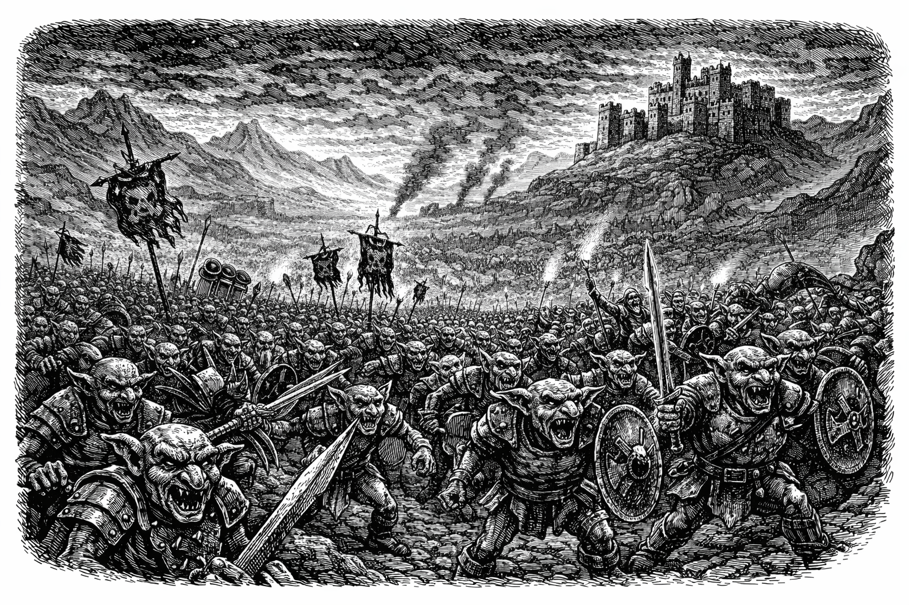

# Gygax - Virtual Tabletop



Old-school D&D virtual tabletop. A web application that lets a Dungeon Master host B/X D&D games online for a group of players.

Existing VTT solutions like Roll20 and Foundry are complex, expensive, or focused on modern D&D editions. Gygax is a streamlined VTT that embraces the simplicity of old-school (OSR) gameplay with a 1981 Moldvay rulebook aesthetic.

## Features

- **Campaigns & Adventures** — Organize game content into campaigns containing multiple adventures
- **Character Sheets** — B/X-style player character creation
- **Map Drawing** — Hex grids for wilderness, square grids for dungeons, with terrain stamping, labels, and paths
- **Map Import/Export** — Save and load maps as JSON
- **World Maps** — Campaign-level world maps shared across adventures
- **Authentication** — Email/password auth with email verification and password reset

### Planned

- NPC creation, backdrops, DM notes
- Live game sessions with player joining
- Fog of war
- Real-time chat with dice rolling
- WebRTC voice chat

## Tech Stack

- **Frontend:** React, Vite, Tailwind, Neobrutalism components
- **Backend:** Node.js, Fastify, WebSockets
- **Database:** PostgreSQL, Prisma ORM
- **Language:** TypeScript (full-stack)
- **Monorepo:** npm workspaces

## Prerequisites

- Node.js >= 24.13.0
- Docker & Docker Compose

## Getting Started

```bash
# Install dependencies
npm install

# Start all services (database, server, client) with hot reload
npm run dev

# In a separate terminal, run database migrations
npm run db:migrate
```

The client runs at `http://localhost:5173` and the server at `http://localhost:3000`.

## Commands

```bash
# Development
npm run dev              # Start all containers
npm run dev:build        # Rebuild and start containers
npm run dev:down         # Stop all containers
npm run dev:logs         # Tail logs from all services

# Database
npm run db:generate      # Generate Prisma client
npm run db:migrate       # Create and apply migrations
npm run db:migrate:reset # Drop DB and re-run all migrations
npm run db:studio        # Open Prisma Studio

# Quality
npm run lint             # Lint check
npm run typecheck        # TypeScript check
npm test                 # Run tests
npm run build            # Production build
```

## Project Structure

```
client/              # React SPA (Vite)
server/              # Fastify API + WebSocket server
shared/              # Shared types and constants
prisma/              # Database schema and migrations
docker/              # Docker configurations
specs/               # Implementation specs
```

## License

Private — all rights reserved.
